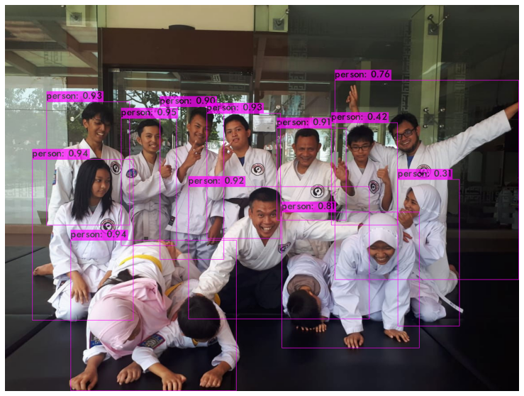
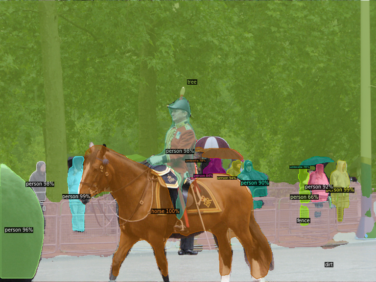
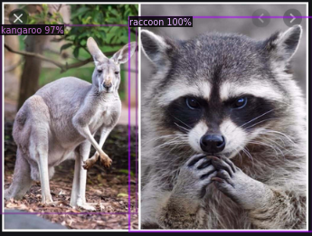

# object-detection-playground

A Brief Notebook Powered by Google Colab with their GPU's Tesla !

## Index

From Here You can find how to run Object Detector , training customize Dataset and OCR 

Feel free to browse the Corresponding Project above.

## Requirements

- Python 3.0
- Jupyter Notebook
- PYTorch or Tensorflow
- OpenCV
- and a modern GPU to train a dataset

## Preview

---

---

---

## Citation

[MASK_RCNN](https://github.com/matterport/Mask_RCNN)

[DARKNET](https://github.com/AlexeyAB/darknet)

[CRAFT Research Journal](https://arxiv.org/abs/1904.01941)

[Facebook Researcher Yu Xin Wu](https://github.com/facebookresearch/detectron2)
